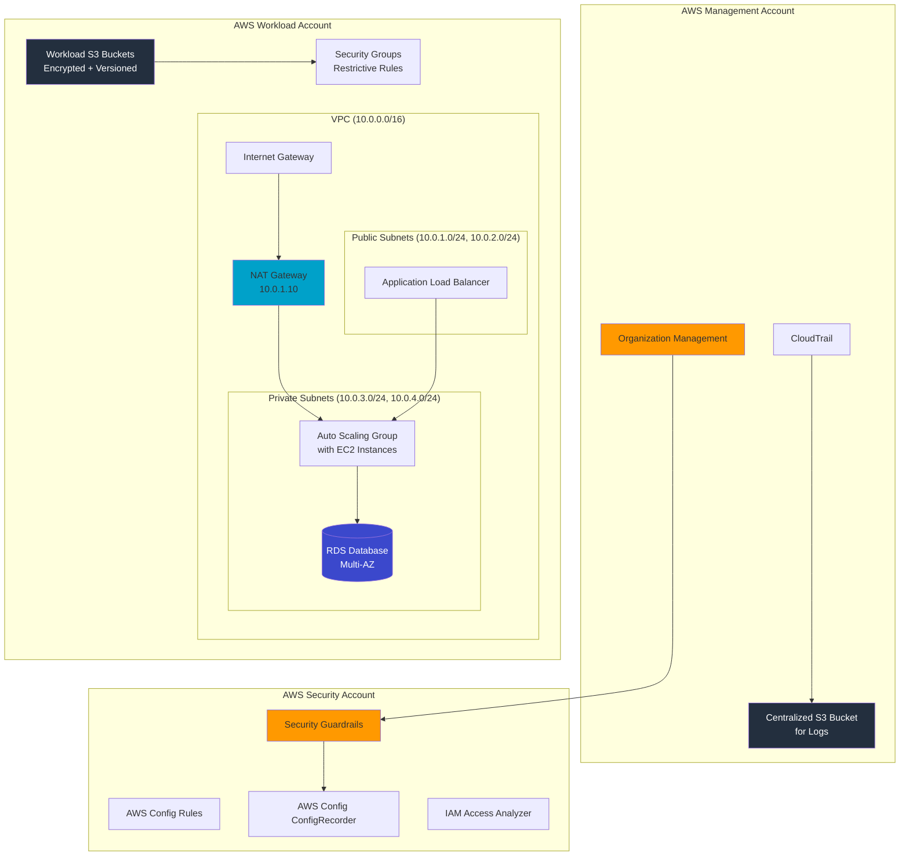

# 🔐 Secure Cloud Landing Zone

A production-ready, multi-account AWS architecture implementing defense-in-depth security controls following AWS Well-Architected Framework best practices.

[](https://www.terraform.io/)
[](https://aws.amazon.com/security/)
[](LICENSE)

---

## 📋 Table of Contents

- [Architecture](#architecture)
- [What This Project Does](#what-this-project-does)
- [Security Controls Implemented](#security-controls-implemented)
- [Prerequisites](#prerequisites)
- [Deployment](#deployment)
- [Project Structure](#project-structure)
- [Environment Details](#environment-details)
- [Security Best Practices](#security-best-practices)
- [Compliance Mapping](#compliance-mapping)

---

## Architecture



### Multi-Account Structure

```
┌─────────────────────────────────────────────────────────────────┐
│                     AWS ORGANIZATION                             │
├─────────────────────────────────────────────────────────────────┤
│  Management Account (111111111111)                               │
│  └── Organization Root                                          │
│      ├── Security Account (222222222222)                        │
│      │   └── Security Tools, Guardrails, Audit                  │
│      └── Workload Account (333333333333)                         │
│          └── Application Workloads                               │
└─────────────────────────────────────────────────────────────────┘
```

---

## What This Project Does

This **Secure Cloud Landing Zone** implements a hardened, multi-account AWS environment designed for enterprise-grade security:

### 🔑 Core Components

| Component | Purpose | Security Benefit |
|-----------|---------|------------------|
| **AWS Organizations** | Centralized account governance | Simplified permission management, consolidated billing |
| **CloudTrail** | API activity logging | Full audit trail of all AWS actions |
| **VPC with Subnets** | Network isolation | Reduces attack surface, enables micro-segmentation |
| **NAT Gateway** | Outbound internet access | Private subnets can access internet without inbound exposure |
| **S3 Buckets** | Secure object storage | Encryption at rest, versioning, blocked public access |
| **Security Groups** | Instance-level firewall | Stateful filtering, least-privilege access |
| **AWS Config** | Compliance monitoring | Continuous security assessment |
| **IAM Roles** | Secure access delegation | Cross-account access without long-term credentials |

---

## Security Controls Implemented

### 🛡️ Network Security

| Control | Implementation | Why It Matters |
|---------|---------------|----------------|
| **Public/Private Subnet Isolation** | Public subnets for ALB only; all compute in private | Minimizes exposure of compute resources |
| **NAT Gateway for Outbound** | Private instances initiate outbound, not inbound | Prevents direct internet access to workloads |
| **Security Group Deny-All** | Default egress all denied, ingress restricted | Zero-trust network model |
| **No Direct Internet Access** | Private subnets have no direct IGW route | Defense in depth |

### 🔒 Data Protection

| Control | Implementation | Why It Matters |
|---------|---------------|----------------|
| **S3 Encryption (AES-256)** | All buckets have `sse_algorithm: AES256` | Protects data at rest |
| **S3 Versioning** | `versioning_enabled: true` | Protects against accidental deletion/malicious overwrites |
| **S3 Public Access Block** | `block_public_acls: true`, `block_public_policy: true` | Prevents accidental data exposure |
| **S3 Lifecycle Rules** | Incomplete multipart uploads cleaned after 7 days | Reduces storage waste and attack surface |

### 📋 Access Control

| Control | Implementation | Why It Matters |
|---------|---------------|----------------|
| **IAM Role Assumption** | Workloads use roles, not access keys | No long-term credentials exposed |
| **Service Control Policies** | Restrict actions across accounts | Prevents privilege escalation |
| **Security Group Reference** | SGs reference each other by security group ID | Reduces hardcoded IP dependencies |

### 🔍 Logging & Monitoring

| Control | Implementation | Why It Matters |
|---------|---------------|----------------|
| **CloudTrail Multi-Region** | `is_multi_region_trail: true` | Captures API activity globally |
| **CloudTrail Log File Validation** | `enable_log_file_validation: true` | Detects tampering with logs |
| **S3 Bucket for CloudTrail** | Dedicated log bucket with MFA delete | Immutable audit trail |
| **AWS Config Advanced** | Records all resource changes | Compliance visibility |

---

## Prerequisites

### Required Tools

| Tool | Version | Purpose |
|------|---------|---------|
| **Terraform** | ≥ 1.0 | Infrastructure as Code |
| **AWS CLI** | ≥ 2.0 | AWS API access |
| **jq** | Latest | JSON processing |

### AWS Requirements

- AWS Account(s) with appropriate permissions
- AWS Organization already created (for multi-account features)
- IAM user/role with AdministratorAccess

### Environment Variables

```bash
export AWS_ACCESS_KEY_ID="your_access_key"
export AWS_SECRET_ACCESS_KEY="your_secret_key"
export AWS_DEFAULT_REGION="us-east-1"
```

---

## Deployment

### Quick Start

```bash
# Clone the repository
git clone https://github.com/yourusername/secure-cloud-landing-zone.git
cd secure-cloud-landing-zone

# Initialize Terraform
terraform init

# Review planned changes
terraform plan -var-file="environments/dev.tfvars"

# Apply infrastructure
terraform apply -var-file="environments/dev.tfvars"
```

### Deployment by Environment

```bash
# Development
terraform apply -var-file="environments/dev.tfvars"

# Production
terraform apply -var-file="environments/prod.tfvars"
```

### Terraform Variables

| Variable | Description | Default |
|----------|-------------|---------|
| `aws_region` | AWS region for deployment | `us-east-1` |
| `environment` | Environment name | `dev` |
| `workload_account_id` | Target workload AWS account ID | `""` |
| `log_archive_bucket_name` | S3 bucket for CloudTrail logs | `""` |
| `enable_cloudtrail` | Enable CloudTrail logging | `true` |
| `enable_aws_config` | Enable AWS Config rules | `true` |

---

## Project Structure

```
secure-cloud-landing-zone/
├── README.md                           # This file
├── LICENSE                             # MIT License
├── .gitignore                          # Git ignore patterns
│
├── terraform/                          # Terraform Infrastructure
│   ├── main.tf                         # Root module orchestration
│   ├── providers.tf                    # AWS provider configuration
│   ├── variables.tf                   # Input variable definitions
│   ├── outputs.tf                     # Output definitions
│   │
│   ├── modules/                       # Reusable Terraform modules
│   │   ├── organization/              # AWS Organizations management
│   │   │   ├── main.tf
│   │   │   ├── variables.tf
│   │   │   └── outputs.tf
│   │   │
│   │   ├── network/                   # VPC and networking
│   │   │   ├── main.tf
│   │   │   ├── variables.tf
│   │   │   └── outputs.tf
│   │   │
│   │   ├── security/                  # Security groups and S3
│   │   │   ├── main.tf
│   │   │   ├── variables.tf
│   │   │   └── outputs.tf
│   │   │
│   │   ├── logging/                   # CloudTrail and logging
│   │   │   ├── main.tf
│   │   │   ├── variables.tf
│   │   │   └── outputs.tf
│   │   │
│   │   └── iam/                       # IAM roles and policies
│   │       ├── main.tf
│   │       ├── variables.tf
│   │       └── outputs.tf
│   │
│   └── environments/                  # Environment-specific configs
│       ├── dev.tfvars
│       └── prod.tfvars
│
├── aws-config/                        # AWS Config Rules
│   └── rules.tf                       # Security compliance rules
│
├── docs/                              # Documentation
│   └── EXECUTIVE_SUMMARY.md          # Business value document
│
└── scripts/                           # Automation scripts
    └── deploy.sh                     # Deployment automation
```

---

## Environment Details

### Development Environment (`dev.tfvars`)

```hcl
environment              = "dev"
aws_region               = "us-east-1"
enable_cloudtrail        = true
enable_aws_config        = true
log_retention_days       = 30
enable_mfa_delete       = false
```

### Production Environment (`prod.tfvars`)

```hcl
environment              = "prod"
aws_region               = "us-east-1"
enable_cloudtrail        = true
enable_aws_config        = true
log_retention_days       = 365
enable_mfa_delete       = true
```

---

## Security Best Practices

### ✅ What This Project Does Right

1. **Least Privilege Access**: All IAM policies use specific actions, not `*`
2. **Defense in Depth**: Multiple layers of security (network + data + access)
3. **Immutable Infrastructure**: All changes through Terraform
4. **Audit Everything**: CloudTrail + AWS Config for complete visibility
5. **Secure by Default**: S3 public access blocked, encryption enforced

### ⚠️ Production Considerations

| Area | Recommendation |
|------|----------------|
| **Secrets** | Use AWS Secrets Manager or Parameter Store for credentials |
| **SSH Access** | Use Systems Manager Session Manager instead of SSH |
| **Keys** | Consider AWS KMS for customer-managed keys |
| **Networking** | Add VPC Flow Logs for network traffic analysis |
| **Monitoring** | Integrate with AWS Security Hub for aggregated findings |

---

## Compliance Mapping

This landing zone helps address compliance requirements for:

| Framework | Controls Supported |
|-----------|-------------------|
| **SOC 2** | CC6.1, CC6.3, CC6.6 (Access Control, Encryption) |
| **PCI DSS** | Req 1, 2, 3, 4, 6 (Network, Data Protection) |
| **HIPAA** | Technical Safeguards (Encryption, Access) |
| **GDPR** | Art 32 (Security of Processing) |
| **ISO 27001** | A.10, A.12, A.18 (Cryptography, Operations Security) |

---

## Clean Up

```bash
# Destroy all resources
terraform destroy -var-file="environments/dev.tfvars"

# Remove Terraform state files
rm -rf .terraform/
```

---

## Contributing

1. Fork the repository
2. Create a feature branch (`git checkout -b feature/amazing-feature`)
3. Commit changes with security rationale
4. Push to the branch
5. Open a Pull Request

---

## License

This project is licensed under the MIT License - see the [LICENSE](LICENSE) file for details.

---

## Author

Built with 🔒 for cybersecurity professionals who care about cloud security.
